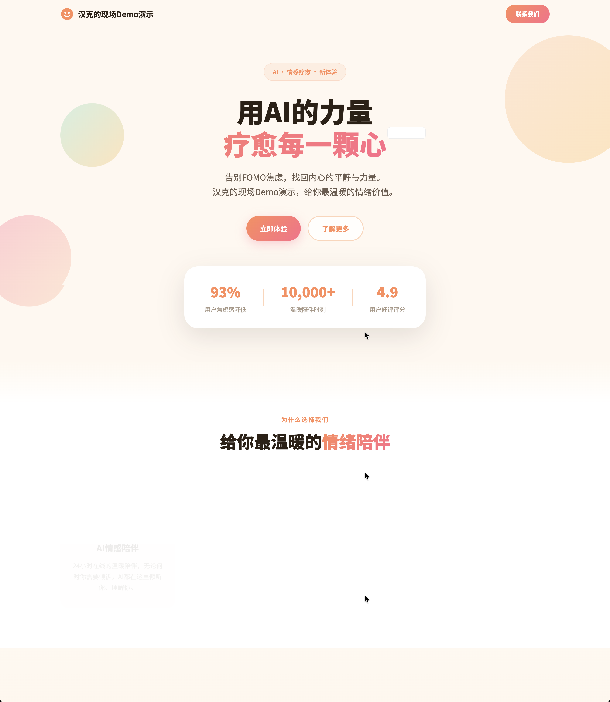

# idea-to-github-pages

> 跟你的 AI 助手聊聊天，网页就做好了，还能拿到一个别人都能点开的链接。零基础可用。

---

## 三步搞定

### 1. 装一个 AI 助手

推荐 WorkBuddy，或者其他支持 Skill 的 Agent（Claude Code、Codex、Coze 扣子等）。

### 2. 安装这个 Skill

对助手说：

```
帮我安装 github.com/HankGuo/idea-to-github-pages 仓库里的 Skill
```

### 3. 说出你的想法

对助手说：

```
帮我做一个网页
```

助手会像朋友聊天一样问你几个问题，然后自动帮你做好页面、变成一个链接发给你。全程不需要任何技术知识。

---

## 效果演示

下面是一个真实的使用案例：用户只用了几句对话，就得到了一个完整的网页和公开链接。

### 对话过程

用户对助手说「帮我做一个网页」，然后像聊天一样回答了几个问题：


### 生成效果

从对话到上线，全程无需写任何代码：



---

## 文件说明

```
idea-to-github-pages/
├── SKILL.md                    # Skill 主流程
├── README.md                   # 本文件
├── assets/
│   ├── prompt-screenshot.png   # 对话过程截图（效果演示）
│   └── effect-screenshot.png   # 生成页面截图（效果演示）
└── references/
    ├── design-rules.md         # 自包含设计规则集
    └── github-pages-deploy.md  # 部署参考（内部用）
```

---

## 设计规则参考

本 Skill 内置的 `design-rules.md` 编写时参考了以下开源项目的思路：

- **design-taste-frontend** — 反 AI 模板化前端设计
- **taste-design** — Google Stitch 语义化设计系统
- **frontend-design** — 大胆美学方向指引
- **ui-ux-pro-max** — 风格/配色/字体设计数据库

感谢这些项目的作者。本 Skill 是一个独立的、自包含的工作流——不依赖上述项目运行，但受益于它们的思路。

---

MIT
